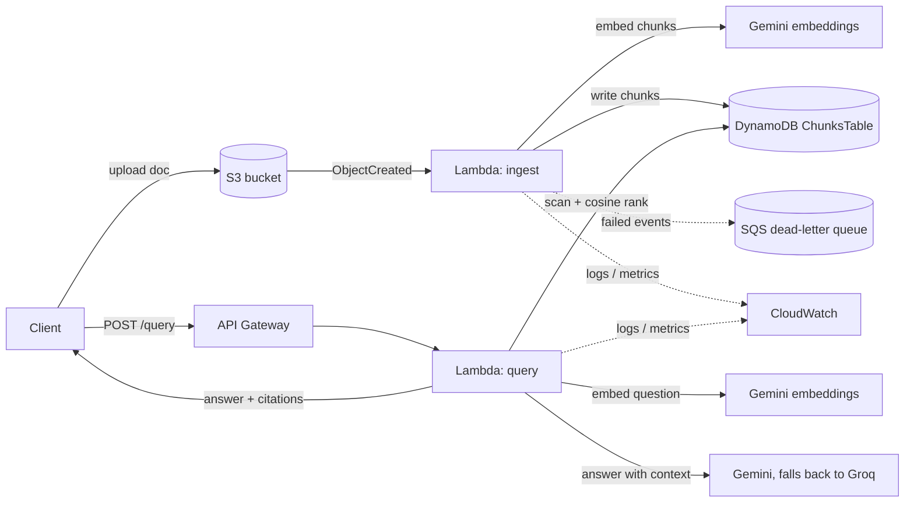

# AWS Document Q&A

A small serverless RAG API on AWS. You upload documents, then ask questions about
them and get back an answer with citations to the chunks it used. The documents
I'm using are AWS docs, so right now it basically answers AWS questions.

I built this mostly to have a real AWS project to point at - Lambda, DynamoDB,
S3, API Gateway, all defined with CDK. The part I care about is the reliability
stuff (retries, LLM fallback, a dead-letter queue for failed ingests), not the
RAG pattern itself.

**Status:** work in progress. Day 1 is done - the ingestion side (upload,
chunk, embed, store). Query API and the rest are still coming.

## Architecture



The query path, the fallback, and the DLQ are still planned - Day 1 covers
S3 -> ingest Lambda -> DynamoDB.

There's no vector database. The table stores the vectors as JSON and the Lambda
does the cosine similarity in memory. Fine at this size; I'd move to OpenSearch
or pgvector if the corpus got large.

## Why these choices

- **DynamoDB instead of a vector DB** - on-demand DynamoDB costs nothing when
  idle. OpenSearch Serverless bills by the hour no matter what.
- **Gemini / Groq instead of Bedrock** - Bedrock charges per token from the
  first call. Gemini and Groq both have real free tiers.
- **Lambda instead of EC2** - the work is bursty, a few seconds when a doc
  lands and then nothing. An instance would just sit there costing money.
- **API key in SSM Parameter Store** - free, and the key never ends up in the
  repo or the CloudFormation template. Secrets Manager would cost per secret.

The whole thing is meant to stay inside the AWS free tier.

## Running it

You need AWS credentials, Python 3.12, Node (for the CDK CLI), and a Gemini API
key.

```bash
cd infrastructure
python -m venv .venv && source .venv/Scripts/activate
pip install -r requirements.txt

# store the API key once
aws ssm put-parameter --name /aws-doc-qa/gemini-api-key --type SecureString \
  --value "YOUR_KEY" --region us-east-2

cdk deploy InfrastructureStack --require-approval never

cd .. && python scripts/upload_document.py corpus/lambda-limits.md
```

## Plan

- [x] Day 1 - ingestion: DynamoDB table, ingest Lambda, S3 trigger
- [ ] Day 2 - query Lambda + API Gateway, end to end
- [ ] Day 3 - Gemini/Groq fallback, retries, SQS dead-letter queue, CloudWatch alarms
- [ ] Day 4 - retrieval evaluation (precision, hallucination rate), tighten IAM
