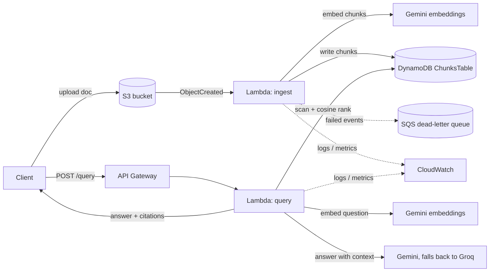

# AWS Document Q&A

**[Live demo](http://infrastructurestack-demositebucket841d0dc4-9oubllnkntil.s3-website.us-east-2.amazonaws.com)**
\- ask it a question, get a real answer from the deployed API with citations.
Served straight from S3 static website hosting (no third-party host, no
backend of its own beyond the API below).

A small serverless RAG API on AWS. You upload documents, then ask questions about
them and get back an answer with citations to the chunks it used. The documents
I'm using are AWS docs, so right now it basically answers AWS questions.

I built this mostly to have a real AWS project to point at - Lambda, DynamoDB,
S3, API Gateway, all defined with CDK. The part I care about is the reliability
stuff (retries, LLM fallback, a dead-letter queue for failed ingests), not the
RAG pattern itself.

**Status:** deployed and working. Live API, real ingestion, real answers with
citations, and a small eval harness run against it (see below).

## Architecture



There's no vector database. The table stores the vectors as JSON and the Lambda
does the cosine similarity in memory. Fine at this size; I'd move to OpenSearch
or pgvector if the corpus got large.

## Why these choices

- **DynamoDB instead of a vector DB** - on-demand DynamoDB costs nothing when
  idle. OpenSearch Serverless bills by the hour no matter what.
- **Gemini / Groq instead of Bedrock** - Bedrock charges per token from the
  first call. Gemini and Groq both have real free tiers.
- **Lambda instead of EC2** - the work is bursty, a few seconds when a doc
  lands and then nothing. An instance would just sit there costing money.
- **API key in SSM Parameter Store** - free, and the key never ends up in the
  repo or the CloudFormation template. Secrets Manager would cost per secret.
- **A Lambda layer for the shared Gemini/Groq client** - both functions need
  the same embed/generate/retry code, so it lives in one place instead of two
  copies drifting apart.

The whole thing is meant to stay inside the AWS free tier. The one exception:
API Gateway's free tier is 1M requests/month for 12 months, then ~$1/million -
at this project's traffic that's fractions of a cent, but it's worth being
honest that it's not permanently free the way Lambda/DynamoDB/S3 are.

## Reliability

- Retry with backoff on every Gemini call, but only for transient failures
  (429/5xx/timeout) - a bad request fails fast instead of retrying a bug 3 times
- If Gemini's answer call keeps failing, the query Lambda falls back to Groq;
  the response says which provider actually answered
- SQS dead-letter queue on the ingest Lambda, so a document that fails to
  ingest is visible and replayable instead of silently vanishing
- Every request logs one JSON line (latency, success, provider) to CloudWatch;
  three alarms watch ingest errors, query errors, and DLQ depth

Deploying this for real (rather than just `cdk synth` passing) surfaced four
real bugs in a row - a reserved SSM parameter prefix, two retired Gemini
models, and Groq's CDN blocking Lambda's default User-Agent. None of that
shows up in a mocked unit test; it only shows up by actually deploying and
hitting the real APIs. Details in `INTERVIEW_NOTES.md` (local, not committed).

## Eval

`scripts/eval.py` runs a fixed set of questions against the live deployed API
(not a mock) and checks three things: did retrieval pull a chunk from the
right source document, does the answer contain the expected fact, and for
questions the corpus can't answer at all, does the model decline instead of
making something up.

```
retrieval hit rate:  100%  (8/8)
answer accuracy:     100%  (8/8)
hallucination rate:  0%  (0/3)
```

(An earlier run scored 62% on answer accuracy - not because retrieval failed,
but because Gemini's free tier rate-limited mid-run and a few questions
answered through the Groq fallback with different phrasing than my keyword
check expected. Retrieval held at 100% through that too. Recorded both runs
rather than only keeping the good one - see `INTERVIEW_NOTES.md`.)

## IAM

The deploying IAM user (`shikha-dev`) had `AdministratorAccess` while the
project's service footprint was still being figured out. It's now scoped down
to `infrastructure/iam/shikha-dev-least-privilege.json` - mostly just
`sts:AssumeRole` on the IAM roles `cdk bootstrap` already created for
deployment, plus the handful of direct actions actually used day to day (SSM,
S3 upload, DynamoDB scan, CloudWatch Logs). Verified by removing
`AdministratorAccess` entirely and re-running a deploy + the eval harness
against the scoped policy alone.

## Running it

You need AWS credentials, Python 3.12, Node (for the CDK CLI), a Gemini API
key, and a Groq API key.

```bash
cd infrastructure
python -m venv .venv && source .venv/Scripts/activate
pip install -r requirements.txt

# store the API keys once
aws ssm put-parameter --name /docqa/gemini-api-key --type SecureString \
  --value "YOUR_GEMINI_KEY" --region us-east-2
aws ssm put-parameter --name /docqa/groq-api-key --type SecureString \
  --value "YOUR_GROQ_KEY" --region us-east-2

cdk deploy InfrastructureStack --require-approval never

cd ..
python scripts/upload_document.py corpus/lambda-limits.md
python scripts/ask.py "What is the maximum Lambda timeout?"
python scripts/eval.py
```

## Plan

- [x] Day 1 - ingestion: DynamoDB table, ingest Lambda, S3 trigger
- [x] Day 2 - query Lambda + API Gateway, end to end
- [x] Day 3 - Gemini/Groq fallback, retries, SQS dead-letter queue, CloudWatch alarms
- [x] Day 4 - deployed for real, retrieval eval, IAM scoped to least-privilege
