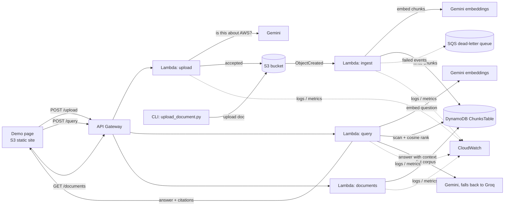

# AWS Document Q&A

**[Live demo](http://infrastructurestack-demositebucket841d0dc4-9oubllnkntil.s3-website.us-east-2.amazonaws.com)**
\- ask it a question, get a real answer from the deployed API with citations.
Shows a live "knowledge base" panel of exactly which documents are
answerable, and you can upload your own (AWS-related content only - it's
checked). Served straight from S3 static website hosting (no third-party
host, no backend of its own beyond the API below).

A small serverless RAG API on AWS. You upload documents, then ask questions about
them and get back an answer with citations to the chunks it used. The corpus
(`corpus/*.md`) is a small set of real AWS documentation excerpts - Lambda
quotas, DynamoDB basics, S3 storage classes - paraphrased from AWS's own docs
with the source URL on each file, not invented facts.

I built this mostly to have a real AWS project to point at - Lambda, DynamoDB,
S3, API Gateway, all defined with CDK. The part I care about is the reliability
stuff (retries, LLM fallback, a dead-letter queue for failed ingests), not the
RAG pattern itself.

**Status:** deployed and working. Live API, real ingestion, real answers with
citations, and a small eval harness run against it (see below).

## Architecture



There's no vector database. The table stores the vectors as JSON and the Lambda
does the cosine similarity in memory. Fine at this size; I'd move to OpenSearch
or pgvector if the corpus got large.

## Why these choices

- **DynamoDB instead of a vector DB** - on-demand DynamoDB costs nothing when
  idle. OpenSearch Serverless bills by the hour no matter what.
- **Gemini / Groq instead of Bedrock** - Bedrock charges per token from the
  first call. Gemini and Groq both have real free tiers.
- **Lambda instead of EC2** - the work is bursty, a few seconds when a doc
  lands and then nothing. An instance would just sit there costing money.
- **API key in SSM Parameter Store** - free, and the key never ends up in the
  repo or the CloudFormation template. Secrets Manager would cost per secret.
- **A Lambda layer for the shared Gemini/Groq client** - both functions need
  the same embed/generate/retry code, so it lives in one place instead of two
  copies drifting apart.

- **S3 static website hosting for the demo page, not a third-party host** -
  the whole project's argument is "AWS-native," so the demo shouldn't live
  somewhere else. Plain HTTP (no CloudFront), which is an honest tradeoff for
  a public read-only page with nothing sensitive on it.
- **An LLM call to gate uploads, not a keyword filter** - "is this document
  about AWS" is a judgment call a regex can't make reliably; a cheap
  classification prompt (same Gemini/Groq client as everything else) can.

The whole thing is meant to stay inside the AWS free tier. The one exception:
API Gateway's free tier is 1M requests/month for 12 months, then ~$1/million -
at this project's traffic that's fractions of a cent, but it's worth being
honest that it's not permanently free the way Lambda/DynamoDB/S3 are.

## Upload + demo

The only public *write* surface in the project is `POST /upload` - everything
else is read-only or S3-event-triggered. It validates hard before touching
anything: allowed extension (`.txt`/`.md`/`.markdown`/`.rst`), a 20 KB size
cap, and an LLM check that the content is actually AWS-related (rejects with
HTTP 422 and why if not). Accepted uploads land in the same S3 bucket the CLI
script uses, so ingestion is identical either way. The route is throttled
separately from `/query` (1 req/s, burst 2 vs 10 req/s, burst 20) since
uploads should be rare and each one costs an LLM call.

`GET /documents` lists what's currently in the corpus (document name + chunk
count, no LLM call) - the demo page's "Knowledge base" panel is just that
endpoint rendered, so visitors see what's actually answerable before they ask
anything, and it refreshes itself after an upload is accepted.

## Reliability

- Retry with backoff on every Gemini call, but only for transient failures
  (429/5xx/timeout) - a bad request fails fast instead of retrying a bug 3 times
- If Gemini's answer call keeps failing, the query Lambda falls back to Groq;
  the response says which provider actually answered
- SQS dead-letter queue on the ingest Lambda, so a document that fails to
  ingest is visible and replayable instead of silently vanishing
- Every request logs one JSON line (latency, success, provider) to CloudWatch;
  three alarms watch ingest errors, query errors, and DLQ depth

Deploying this for real (rather than just `cdk synth` passing) surfaced a
string of real bugs none of which show up in a mocked unit test: a reserved
SSM parameter prefix, two retired Gemini models, Groq's CDN blocking Lambda's
default User-Agent, a script that grabbed the wrong S3 bucket once there were
two, a CloudFormation resource whose nested properties want different
casing than its own top-level ones, a missing resource dependency that broke
deploy ordering, and a stack that got stuck in `UPDATE_ROLLBACK_FAILED` and
needed a scoped IAM permission (and, once, a temporary admin re-attach via
root) to recover. Every one of them only exists because something real -
AWS's own naming rules, a vendor's model lifecycle, a real second resource,
CloudFormation's own inconsistencies - was on the other end of the call.
Details in `INTERVIEW_NOTES.md` (local, not committed).

## Eval

`scripts/eval.py` runs a fixed set of questions against the live deployed API
(not a mock) and checks three things: did retrieval pull a chunk from the
right source document, does the answer contain the expected fact, and for
questions the corpus can't answer at all, does the model decline instead of
making something up.

```
retrieval hit rate:  100%  (8/8)
answer accuracy:     88%  (7/8)
hallucination rate:  0%  (0/3)
```

Retrieval has been 100% across every run. Answer accuracy has moved around
run to run (as low as 62%) - not from wrong retrieval, but from two separate
harness issues, both fixed rather than papered over by re-running until the
score looked good:

1. Gemini's free tier rate-limits under back-to-back calls, so some questions
   answer through the Groq fallback with different phrasing than my exact
   keyword check expected.
2. Both LLMs favor typographically "correct" Unicode punctuation over plain
   ASCII - a narrow no-break space in "400 KB", a non-breaking hyphen in
   "on-demand" - which an exact-string match was wrongly failing. The eval
   script now normalizes both before comparing.

The one remaining miss is a genuine limitation of keyword matching, not a
bug: a correct answer paraphrased using different words than my expected
keyword. Full history in `INTERVIEW_NOTES.md`.

## IAM

The deploying IAM user (`shikha-dev`) had `AdministratorAccess` while the
project's service footprint was still being figured out. It's now scoped down
to `infrastructure/iam/shikha-dev-least-privilege.json` - mostly just
`sts:AssumeRole` on the IAM roles `cdk bootstrap` already created for
deployment, plus the handful of direct actions actually used day to day (SSM,
S3 upload, DynamoDB scan/query, CloudWatch Logs, Lambda inspect). Verified by
removing `AdministratorAccess` entirely and re-running a deploy + the eval
harness against the scoped policy alone.

One addition since: a deploy that failed mid-update left the stack stuck in
`UPDATE_ROLLBACK_FAILED`, which needs `cloudformation:ContinueUpdateRollback`
to recover - a permission `cdk deploy` never needs directly (it assumes
`cfn-exec-role` for normal operations), so the scoped policy correctly didn't
have it. That's a legitimate, narrow exception, now added scoped to this one
stack. Recovering also required briefly re-attaching `AdministratorAccess`
via the AWS root account, since a fully-scoped `shikha-dev` can't grant
itself new permissions either - a real demonstration of least-privilege
working exactly as intended, if inconvenient mid-incident.

## Running it

You need AWS credentials, Python 3.12, Node (for the CDK CLI), a Gemini API
key, and a Groq API key.

```bash
cd infrastructure
python -m venv .venv && source .venv/Scripts/activate
pip install -r requirements.txt

# store the API keys once
aws ssm put-parameter --name /docqa/gemini-api-key --type SecureString \
  --value "YOUR_GEMINI_KEY" --region us-east-2
aws ssm put-parameter --name /docqa/groq-api-key --type SecureString \
  --value "YOUR_GROQ_KEY" --region us-east-2

cdk deploy InfrastructureStack --require-approval never

cd ..
python scripts/upload_document.py corpus/lambda-limits.md
python scripts/ask.py "What is the maximum Lambda timeout?"
python scripts/eval.py

# or hit the upload API directly, like the demo page does
curl -X POST "$(aws cloudformation describe-stacks --stack-name InfrastructureStack \
  --region us-east-2 --query "Stacks[0].Outputs[?OutputKey=='QueryApiUrl'].OutputValue" \
  --output text)/upload" \
  -H "Content-Type: application/json" \
  -d '{"filename":"note.md","content":"EC2 instances are billed per second..."}'
```

## Plan

- [x] Day 1 - ingestion: DynamoDB table, ingest Lambda, S3 trigger
- [x] Day 2 - query Lambda + API Gateway, end to end
- [x] Day 3 - Gemini/Groq fallback, retries, SQS dead-letter queue, CloudWatch alarms
- [x] Day 4 - deployed for real, retrieval eval, IAM scoped to least-privilege
- [x] Bonus - real AWS-doc corpus, self-hosted demo page with upload + a
      live knowledge-base panel, per-route throttling
