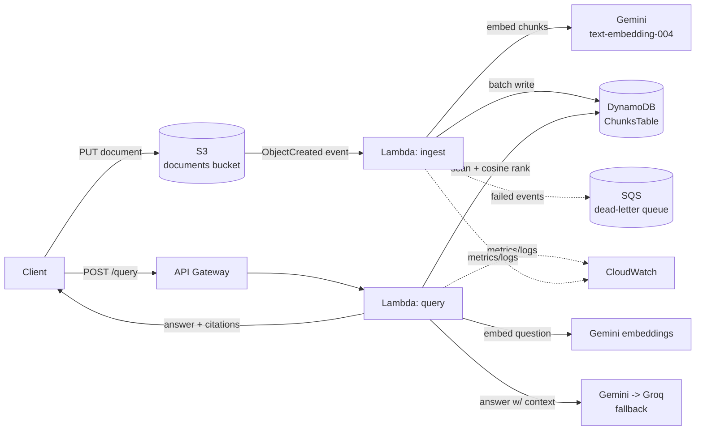

# AWS Document Q&A

A serverless **Retrieval-Augmented Generation (RAG)** API built entirely on
AWS-native infrastructure. It answers natural-language questions grounded in a
corpus of uploaded documents and returns answers **with citations back to the
source chunks**.

The corpus is AWS documentation itself, so the system doubles as a small tool
that answers questions about AWS.

> **Status:** in active development, built in daily slices. Day 1 (the
> ingestion pipeline) is complete. See [Roadmap](#roadmap).

---

## Why this project exists

AWS was on my resume as a skill with no project to back it. This project is the
evidence: AWS-native serverless engineering, infrastructure as code, and a
deliberate reliability layer (retries, provider fallback, dead-letter queues,
audit logging) rather than just a happy-path demo.

Design bias: where an AWS-native option and a generic/portable one are both
reasonable, this project picks the AWS-native one on purpose.

---

## Architecture



### Components

| Component | Service | Role |
|-----------|---------|------|
| Documents bucket | **S3** | Raw document upload; `ObjectCreated` triggers ingestion |
| `ChunksTable` | **DynamoDB** (on-demand) | One item per chunk: text, embedding, source metadata, char offsets |
| Ingest function | **Lambda** (Python 3.12) | Chunk → embed → write, on S3 event |
| Query function | **Lambda** (Python 3.12) | Embed question → retrieve top-k → call LLM → return answer + citations |
| REST endpoint | **API Gateway** | Exposes the query function as `POST /query` |
| Dead-letter queue | **SQS** | Captures failed ingestion events — no silent data loss |
| Observability | **CloudWatch** | Structured per-request logs, metric filters, alarms |
| All infrastructure | **AWS CDK** (Python) | Everything above is defined as code in [`infrastructure/`](infrastructure/) |

### The reliability layer

This is the part that distinguishes the project from a generic RAG demo:

- **Retry with exponential backoff** around embedding and LLM calls
- **Gemini → Groq automatic fallback** if the primary LLM call fails
- **SQS dead-letter queue** on the ingest Lambda so failed documents are
  visible and replayable
- **CloudWatch structured logging** of every request — latency, success/failure,
  and which provider answered

---

## Key design decisions

| Decision | Why | Alternative rejected |
|----------|-----|----------------------|
| DynamoDB for chunks + vectors | Free tier, scales to zero, zero idle cost | RDS+pgvector / OpenSearch Serverless — both bill while idle (OpenSearch ≈ $350/mo) |
| Cosine similarity computed in the Lambda | No vector index needed at this corpus size | A managed vector store — unnecessary cost until ~1M chunks |
| Gemini + Groq for LLM/embeddings | Real free tiers | Amazon Bedrock — pay-per-token from the first call, pulls in OpenSearch for Knowledge Bases |
| Lambda, not EC2/Fargate | Event-driven, bursty workload; scales to zero | A running instance idle-bills 24/7 |
| Gemini called over raw HTTPS (stdlib) | Deployment stays a plain zip, low cold start | The Gemini SDK needs a Lambda layer or Docker bundling |
| API key in SSM Parameter Store (SecureString) | Free; key never in git or the CFN template | Env var (plaintext in template) / Secrets Manager ($0.40/secret/mo) |
| Embedding stored as a JSON string | DynamoDB has no float type; math happens in the Lambda anyway | 768 `Decimal`s per item — heavy and lossy |

Full rationale, including interview-style Q&A and failure modes, is captured
incrementally in `INTERVIEW_NOTES.md` (local, not committed).

---

## Cost

Designed to run **entirely within the AWS always-free tier** at portfolio-scale
usage: Lambda, API Gateway, DynamoDB on-demand, S3, SQS, CloudWatch Logs, and
SSM Parameter Store SecureString (AWS-managed KMS key). LLM and embedding calls
use the Gemini and Groq free tiers. Any change that would incur cost is flagged
before it is created.

---

## Repository layout

```
aws-doc-qa/
  infrastructure/      CDK app (Python) — all AWS resources as code
  lambdas/
    ingest/            S3-triggered: chunk, embed, store        [done]
    query/             API-triggered: retrieve, generate        [planned]
  scripts/
    upload_document.py Upload a local doc to the bucket
  corpus/              Sample documents for ingestion
  tests/               Offline unit tests (chunking, retrieval)
```

---

## Getting started

Prerequisites: an AWS account with credentials configured, Python 3.12,
Node.js (for the CDK CLI), and a [Gemini API key](https://aistudio.google.com/apikey).

```bash
# 1. Install CDK deps
cd infrastructure
python -m venv .venv && source .venv/Scripts/activate   # .venv/bin/activate on macOS/Linux
pip install -r requirements.txt

# 2. Store the Gemini API key (one time) — free SecureString parameter
aws ssm put-parameter --name /aws-doc-qa/gemini-api-key --type SecureString \
  --value "YOUR_GEMINI_API_KEY" --region us-east-2

# 3. Deploy
cdk deploy InfrastructureStack --require-approval never

# 4. Ingest a document
cd .. && python scripts/upload_document.py corpus/lambda-limits.md
```

Run the tests:

```bash
pip install -r tests/requirements.txt
python -m pytest tests/ -q
```

---

## Roadmap

- [x] **Day 1 — Ingestion pipeline:** DynamoDB `ChunksTable`, ingest Lambda
      (chunk → embed → store), S3 event trigger, least-privilege IAM
- [ ] **Day 2 — Query pipeline:** query Lambda (embed → retrieve → generate →
      cite), API Gateway endpoint, end-to-end test
- [ ] **Day 3 — Reliability layer:** Gemini→Groq fallback, retry/backoff,
      SQS dead-letter queue, CloudWatch metric filters and alarms
- [ ] **Day 4 — Evaluation & docs:** retrieval eval harness (precision@k,
      hallucination rate), IAM scoped to least-privilege, architecture write-up

---

## Tech stack

AWS CDK · Lambda · DynamoDB · S3 · API Gateway · SQS · CloudWatch · SSM
Parameter Store · Python 3.12 · Gemini · Groq
